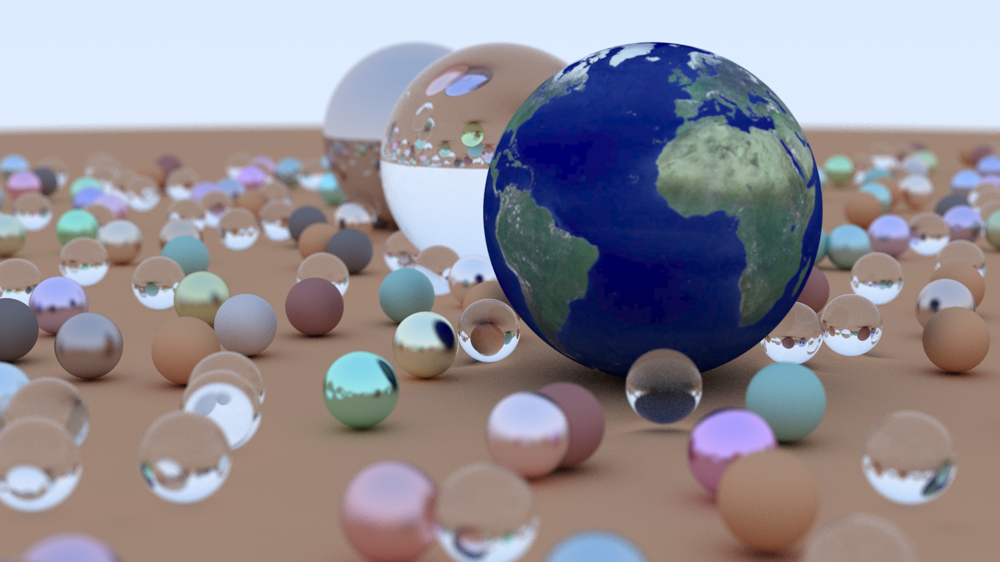
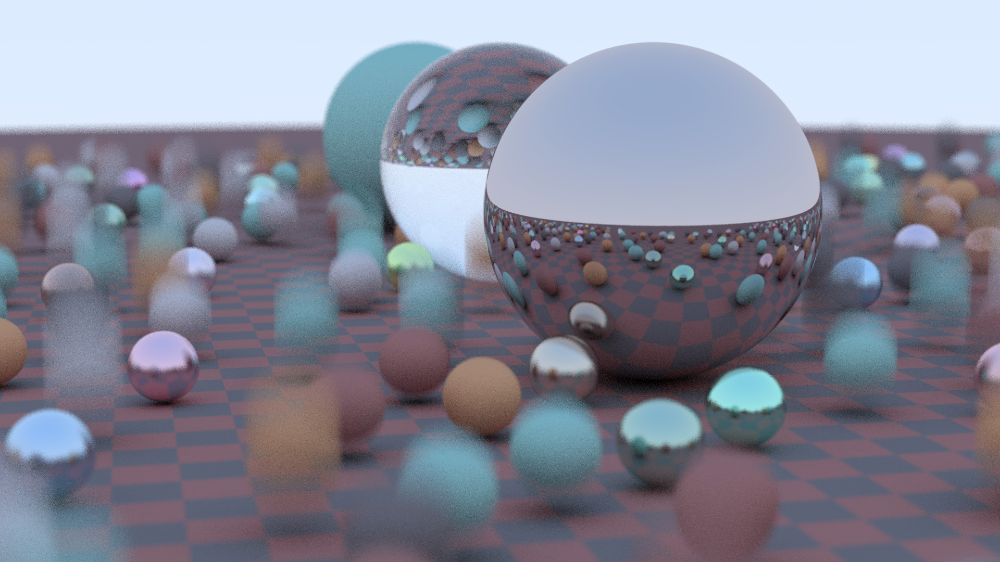
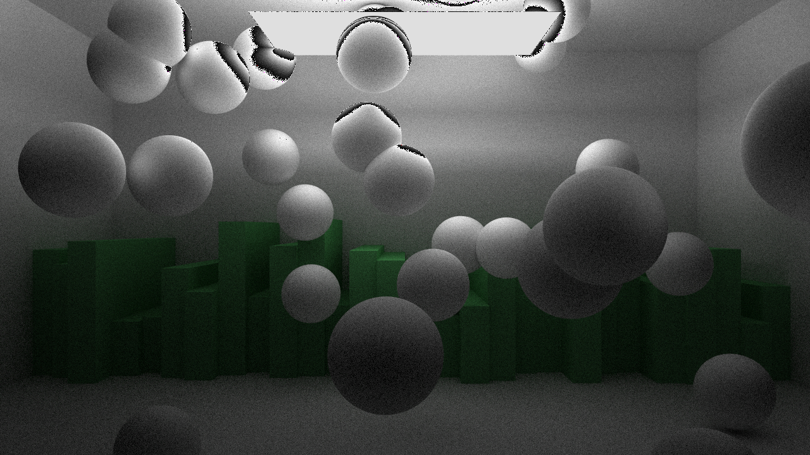

# Raytracer

This is a ray tracer built using Peter Shirley's amazing ray tracing in a weekend trio here https://raytracing.github.io/. I've added some command line options and parallelized the embarrassingly parallel shooting of rays to speed it up a bit.

While I'm still adding features to it, here are some images made with the project.

